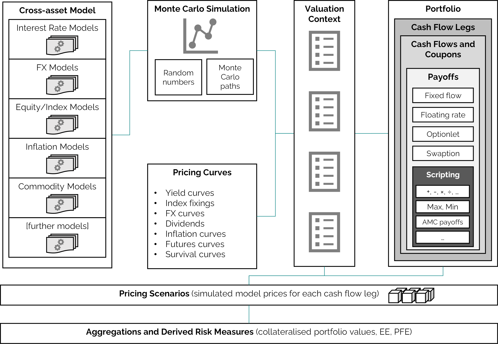

# DiffFusion

[](https://github.com/frame-consulting/DiffFusion.jl/actions/workflows/CI.yml?query=branch%3Amain)

[](https://codecov.io/github/frame-consulting/DiffFusion.jl)

[](https://frame-consulting.github.io/DiffFusion.jl/dev/)

The DiffFusion.jl package implements a framework for joint simulation of financial risk factors, risk-neutral valuation of financial instruments and calculation of portfolio risk measures.

The intended purpose of the package is efficient exposure simulation for XVA and Counterparty Credit Risk (CCR).

An overview of the architecture of the framework is illustrated in below figure.

|  |
|:--:|
| *Architecture of the DiffFusion.jl simulation framework.* |

Details on purpose and scope are presented in the white paper [DiffFusion.jl - A New Exposure Simulation Framework for the Post-Libor World](https://frame-consult.de/docs/DiffFusion.jl_-_A_New_Exposure_Simulation_Framework_for_the_Post-Libor_World.pdf).

For questions and help please get in touch directly via info@frame-consult.de.

## Installation

DiffFusion.jl is a registered Julia package and can be installed via Julia's package manager.

```
using Pkg
Pkg.add("DiffFusion")
```

## Getting Started

Cross-asset exposure simulation can be a complex procedure. Here, we give a minimal example to illustrate the usage of the package.

For a more realistic examples, see the unit tests and component tests.

The basic usage can be decomposed into the following steps:

  - model setup,
  - Monte Carlo simulation,
  - Monte Carlo *path* construction,
  - financial instrument setup,
  - scenario valuation.

All methods are implemented in the `DiffFusion` module and accessible via:
```
using DiffFusion
```

### Model Setup

A basic one-factor Gaussian interest rate model can be set up as follows:

```
δ = DiffFusion.flat_parameter(1.)  # benchmark rate
χ = DiffFusion.flat_parameter( 0.01 )  # mean reversion parameter
σ = DiffFusion.flat_volatility( 0.0050 )  # short rate volatility
model = DiffFusion.gaussian_hjm_model("mdl/HJM1F", δ, χ, σ, nothing, nothing)
```

Details on the setup of model parameters are documented in the [Term Structures](https://frame-consulting.github.io/DiffFusion.jl/dev/termstructures/termstructures/#Term-Structures) section. Available models are documented in the [Models](https://frame-consulting.github.io/DiffFusion.jl/dev/models/models/#Models) section.

### Monte Carlo Simulation

Monte Carlo paths of model risk factors are stored in a `Simulation` object. A simulation object for our example model is calculated as follows:

```
ch = DiffFusion.correlation_holder("Std")  # correlations for more complex models
times =  0.0:0.25:2.0  # simulation times
n_paths = 2^10  # number of simulated paths
sim = DiffFusion.simple_simulation(model, ch, times, n_paths)
```

Further details on Monte Carlo simulation methods are documented in the [Simulations](https://frame-consulting.github.io/DiffFusion.jl/dev/simulations/simulations/#Simulations) section.

### Monte Carlo *Path* Construction

In order to use the Monte Carlo simulation for the pricing of financial instruments we need to specify a *Path* object. For the *Path* object we need term structures and a valuation context.

We use simple flat yield term structures for this example.

```
ts = [
    DiffFusion.flat_forward("yc/Estr", 0.02),  # discount curve
    DiffFusion.flat_forward("yc/Euribor6m", 0.03),  # projection curve
]
```

More details on yield curves and model parameter term structures are documented in the [Term Structures](https://frame-consulting.github.io/DiffFusion.jl/dev/termstructures/termstructures/#Term-Structures) section.

A context links available payoff keys with models and term structures.

```
ctx = DiffFusion.context(
    "Std",
    DiffFusion.numeraire_entry("EUR", "mdl/HJM1F", "yc/Estr"),
    [
        DiffFusion.rates_entry("EUR", "mdl/HJM1F",
            Dict((
                ("ESTR", "yc/Estr"),
                ("EURIBOR6M", "yc/Euribor6m"),
            ))
        ),
    ],
)
```

And a path combines simulation, term structures and context.

```
path = DiffFusion.path(sim, ts, ctx)
```

`Context` and `Path` objects are further documented in the [Paths](https://frame-consulting.github.io/DiffFusion.jl/dev/paths/paths/#Paths) section.

### Financial Instrument Setup

Financial instruments are composed of cash flows (or coupons) and cash flow legs.

We use two simple floating rate coupons and one fixed rate coupon for this example.

```
float_coupons = [
    DiffFusion.SimpleRateCoupon(
        0.25,  # fixing time
        0.25,  # start time
        0.75,  # end time
        0.75,  # pay time
        0.50,  # year fraction
        "EUR:EURIBOR6M",  # curve key
        nothing,  # fixing key (if index rate is already fixed)
        nothing,  # spread rate
    ),
    DiffFusion.SimpleRateCoupon(
        0.75,  # fixing time
        0.75,  # start time
        1.25,  # end time
        1.25,  # pay time
        0.50,  # year fraction
        "EUR:EURIBOR6M",  # curve key
        nothing,  # fixing key (if index rate is already fixed)
        nothing,  # spread rate
    ),
]
fixed_coupons = [
    DiffFusion.FixedRateCoupon(
        1.25,  # pay time
        0.03,  # fixed rate
        1.00,  # year fraction
    ),
]
```

Cash flow legs add additional information to the coupons.

```
float_leg = DiffFusion.cashflow_leg(
    "leg/1",  # an alias as identifier
    float_coupons,
    [ 10_000.00, 10_000.00 ],  # notionals
    "EUR:ESTR",  # curve key for discounting
    nothing,  # key for FX rate if applicable
    -1.0, # payer leg
)
fixed_leg = DiffFusion.cashflow_leg(
    "leg/2",  # an alias as identifier
    fixed_coupons,
    [ 10_000.00 ],  # notionals
    "EUR:ESTR",  # curve key for discounting
    nothing,  # key for FX rate if applicable
    1.0, # receiver leg
)
```

A financial instrument is a list of one or more cash flow legs.

More details on available cash flows and cash flow legs are documented in the [Products](https://frame-consulting.github.io/DiffFusion.jl/dev/products/products/#Products) section.

### Scenario Valuation

For scenario valuation we want to calculate the model price of the instrument on a set of observation times and simulated paths.

```
scenarios = DiffFusion.scenarios(
    [ float_leg, fixed_leg ],
    0.0:0.25:1.5,  # observation times
    path,
    nothing,  # no discounting to t=0
)
```

Scenario prices are stored in a *scenario cube* with the dimensions

  - number of paths,
  - number of time steps,
  - number of legs.

For our example, we can inspect the dimensions of the cube.

```
display(size(scenarios.X))
# Output: (1024, 7, 2)
```

An important measure for XVA and CCR is expected (positive) exposure (EE).

Such measures can now be calculated for a given set of scenario valuation results.

```
using StatsBase

ee = mean(max.(sum(scenarios.X, dims=3), 0.0), dims=1)
display(ee)
# Output:
# 1×7×1 Array{Float64, 3}:
# [:, :, 1] =
#  0.0  7.98524  9.44371  147.817  148.527  0.0  0.0
```

Scenario valuations are further documented in the [Analytics](https://frame-consulting.github.io/DiffFusion.jl/dev/analytics/analytics/#Analytics) section.

## Further Examples

The best way to become familiar with the DiffFusion framework is to have a look at the test suite.

An example for exposure simulation of a Vanilla swap portfolio is implemented in the [scenario generation](https://github.com/frame-consulting/DiffFusion.jl/blob/main/test/componenttests/scenarios/scenarios.jl) component test.

Individual examples on model, simulation and product setup can be found in the [unit tests](https://github.com/frame-consulting/DiffFusion.jl/tree/main/test/unittests). TEST
